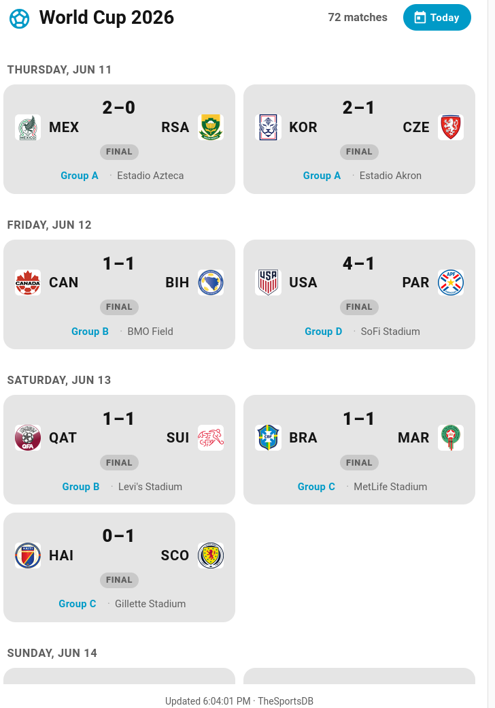
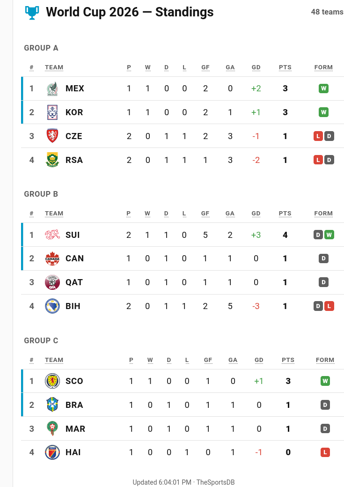

# World Cup Card

A custom [Home Assistant](https://www.home-assistant.io/) Lovelace card that shows the **FIFA World Cup 2026** schedule as a grid on your dashboard. Played matches show the final score, live matches show a pulsing **LIVE** badge with the running score, and upcoming matches show the kickoff time in your local timezone.

It runs **entirely in the browser** using [TheSportsDB](https://www.thesportsdb.com/)'s free public API — no add-on, no backend, no API signup required.

Two companion cards build on it: a **Standings Card** (`worldcup-standings-card.js`) for the live group tables — see [Standings card](#standings-card) — and a **Bracket Card** (`worldcup-bracket-card.js`) that draws the full knockout tree — see [Bracket card](#bracket-card).

**[▶ Live demo](https://koconnorgit.github.io/ha-worldcup-cards/)** — all three cards running as a standalone page.



## Install (single file)

1. Copy `worldcup-card.js` into your Home Assistant `config/www/` folder, so it lives at:

   ```
   config/www/worldcup-card.js
   ```

   (In the File Editor / Samba / SSH add-on, `/config` is the root. Create the `www` folder if it doesn't exist.)

2. Register it as a dashboard resource:

   **Settings → Dashboards → ⋮ (top right) → Resources → + Add Resource**

   - **URL:** `/local/worldcup-card.js`
   - **Resource type:** `JavaScript Module`

   > `/local/` maps to `/config/www/`. If you don't see the *Resources* menu, enable **Advanced Mode** in your user profile.

3. Add the card to a dashboard. Edit a dashboard → **+ Add Card → Manual** (or search "World Cup Card") and paste:

   ```yaml
   type: custom:worldcup-card
   ```

   That's it — the bare config shows the entire tournament schedule, auto-scrolled to today.

If the card doesn't appear after install, hard-refresh your browser (Ctrl/Cmd-Shift-R) to clear the cached old resource.

## Configuration

All options are optional.

| Option | Default | Description |
| --- | --- | --- |
| `title` | `World Cup 2026` | Card header. Set to `""` to hide. |
| `full_schedule` | `true` | Show **every** match of the whole tournament. Set `false` for a rolling window around today. |
| `max_height` | `640px` | Height of the scrollable list. Set `""` for no limit (card grows to fit). |
| `refresh` | `120` | Auto-refresh interval in seconds (minimum 30). Keeps live scores current. |
| `team` | `""` | Only show matches involving this team (substring match, e.g. `USA`, `Brazil`). |
| `compact` | `false` | Hide the venue line for a denser grid (the group label still shows). |
| `days_back` | `2` | *Rolling mode only* (`full_schedule: false`): past days to include. |
| `days_ahead` | `7` | *Rolling mode only*: upcoming days to include. |
| `season` | `"2026"` | Tournament season. |
| `league_id` | `"4429"` | TheSportsDB league id. `4429` = FIFA World Cup. |
| `rounds` | `[1,2,3,32,16,125,150,160,200]` | Round codes to fetch: group matchdays 1–3, Round of 32, Round of 16, Quarter-finals, Semi-finals, Third-place, Final. |
| `api_key` | `"123"` | TheSportsDB API key. `123` is the free shared test key; drop in your own [Patreon key](https://www.thesportsdb.com/) for higher limits. |

### Examples

**Entire tournament, scrollable (default):**

```yaml
type: custom:worldcup-card
```

**Just my team's path through the tournament:**

```yaml
type: custom:worldcup-card
title: USA Fixtures
team: USA
max_height: ""        # no scroll — show them all
```

**Compact "what's on around now" widget for a sidebar:**

```yaml
type: custom:worldcup-card
title: World Cup — This Week
full_schedule: false
days_back: 1
days_ahead: 4
compact: true
```

## Notes

- **Data source / accuracy:** Scores come from TheSportsDB and can lag a live broadcast by a minute or two. All 72 group-stage fixtures load reliably. Knockout fixtures (Round of 32 onward) aren't in the free feed until the bracket fills, so the card ships the fixed FIFA schedule as a fallback: each knockout match shows its real date, kickoff time, and venue with placeholder slot names (e.g. `1A` vs `2B`, `W73` vs `W74`). As soon as the feed starts returning real fixtures for a round, that round's live data replaces the placeholders automatically.
- **Why by round, not by day:** The card fetches each tournament round (`eventsround`) rather than each calendar day. TheSportsDB's free per-day endpoint silently truncates busy match days (it returned only 3 of 5 games on June 14), whereas the round endpoint returns every fixture — so this guarantees the complete schedule.
- **Caching:** Once every match in a round has finished, that round is cached in your browser (its scores never change), so ongoing refreshes only re-poll the in-progress and not-yet-scheduled rounds — keeping the view light on the free API.
- **Team names:** Shown as FIFA 3-letter codes (e.g. `BRA`, `KOR`, `RSA`); hover over a team to expand it to the full country name on a single line.
- **"Updated" stamp:** Reflects the last time the card polled the API (shown with seconds), so you can tell where you are in the refresh window — not just the last time the display changed.
- **Auto-scroll:** On load or page refresh the list jumps to today's matches (or the next match day if today is a rest day). When the periodic auto-refresh updates scores, your scroll position is kept exactly where it was.
- **Timezone:** Kickoff times are converted from UTC to your browser's local timezone.
- **Another competition:** Point `league_id` at any TheSportsDB soccer league to reuse the card for a different tournament.

## Standings card

`worldcup-standings-card.js` is a separate, optional card that shows the **live group standings** — one mini league table per group (Pos · Team · P W D L GF GA GD Pts), with recent form and the qualifying positions highlighted. It uses the same free TheSportsDB API and the same browser-only design, so install it exactly like the schedule card:



1. Copy `worldcup-standings-card.js` into `config/www/`.
2. Add it as a dashboard resource — **URL:** `/local/worldcup-standings-card.js`, **Resource type:** `JavaScript Module`.
3. Add the card:

   ```yaml
   type: custom:worldcup-standings-card
   ```

The two cards are independent — put the schedule and the standings side by side, or use either on its own.

### Standings options

All optional.

| Option | Default | Description |
| --- | --- | --- |
| `title` | `World Cup 2026 — Standings` | Card header. Set to `""` to hide. |
| `max_height` | `640px` | Height of the scrollable list. Set `""` for no limit. |
| `refresh` | `120` | Auto-refresh interval in seconds (minimum 30). |
| `group` | `""` | Show only one group (substring match, e.g. `D` or `Group D`). |
| `highlight_top` | `2` | Rows ranked 1..N per group get an accent bar marking the qualifying spots. Set `0` to disable. |
| `show_form` | `true` | Show the recent W/D/L form column (green/grey/red pills, last 5, oldest→newest). |
| `include_live` | `false` | Also count in-progress matches in the table (live standings). Off = only finished matches count. |
| `compact` | `false` | Drop the W/D/L and GF/GA columns for a denser table (keeps Pos · Team · P · GD · Pts). |
| `season` | `"2026"` | Tournament season. |
| `league_id` | `"4429"` | TheSportsDB league id. `4429` = FIFA World Cup. |
| `group_rounds` | `[1,2,3]` | Round codes that make up the group stage (the matchdays the table is built from). |
| `api_key` | `"123"` | TheSportsDB API key. `123` is the free shared test key. |

**Just my group, compact, in a sidebar:**

```yaml
type: custom:worldcup-standings-card
title: Group D
group: D
compact: true
max_height: ""
```

> **Note — how the tables are built:** The standings are **computed in the browser from the group-stage match results** (the same `eventsround` fixtures the schedule card loads), *not* read from TheSportsDB's `lookuptable` endpoint. That endpoint lags badly early in the tournament — on matchday 1 it returned only the *leader* of each group, so a card reading it would show just one team per group. Building from the fixtures instead gives complete, correct 12-group tables as soon as results come in. Ranking is points → goal difference → goals for → name (the common simplified order; it doesn't apply FIFA's full head-to-head tiebreakers). By default only **finished** matches count toward the table — set `include_live: true` to fold in-progress scores in as well.

> **Rate limits & the "NetworkError" / "Could not load standings" message:** The free shared API key `123` is rate-limited across *all* TheSportsDB users worldwide. When it's throttled it returns HTTP 429 with no CORS headers, which the browser reports as a generic `NetworkError`. To survive this, the card caches each round in your browser's `localStorage` (a round is cached permanently once all its matches finish) and falls back to the cached copy on any failed poll — so once it has loaded successfully even once, later throttling is invisible. The catch is the **very first** load: if the key is being throttled and nothing is cached yet, that initial fetch can still fail. If you hit the error, either **reload a few times** (the 429s are intermittent — one success is enough to seed the cache), or set your own `api_key` from a TheSportsDB [Patreon key](https://www.thesportsdb.com/), which isn't subject to the shared-key throttling. The schedule card shares the same per-round caching, which is why it can keep working while a fresh standings card shows the error.

## Bracket card

`worldcup-bracket-card.js` draws the full **knockout bracket** — Round of 32 through the Final, plus the third-place play-off — as a classic two-sided tree that meets at a centered final. It's a wide card: give it a full-width slot (a panel view, or a full-width cell in the sections view, where it requests the full 12-column span), and it scrolls horizontally if the viewport is narrower than the tree. Install it like the others:

1. Copy `worldcup-bracket-card.js` into `config/www/`.
2. Add it as a dashboard resource — **URL:** `/local/worldcup-bracket-card.js`, **Resource type:** `JavaScript Module`.
3. Add the card:

```yaml
type: custom:worldcup-bracket-card
```

**How the bracket fills in** — in priority order:

1. **Live knockout fixtures** from TheSportsDB once they exist (real teams + scores). A finished tie's winner is propagated into the next round automatically (so the Round-of-16 slot reading "W73" becomes the actual team the moment Match 73 ends).
2. **Our own derivation:** group winners and runners-up are computed from the group-stage results — the same fixtures the schedule and standings cards use — so a Round-of-32 slot fills in *as soon as a group takes shape*, before TheSportsDB publishes the knockout draw. Slots whose group isn't mathematically decided yet are shown **provisional** (italic + dimmed with a dotted underline), and update live as results come in.
3. **The fixed FIFA schedule** for structure, kickoff times and venues, with placeholder slot labels (`1A`, `2B`, `3rd`, `W73`, …) until a real team resolves. Hover any cell for its round, full date and venue.

> **Note — the third-placed slots:** eight Round-of-32 ties take a "best third-placed" team (shown as `3rd`). FIFA assigns *which* third-placed team lands in *which* tie via an official combination table that depends on exactly which groups' thirds qualify, so these are left as `3rd` placeholders rather than guessed. Everything else (group winners/runners-up and all match-winner propagation) resolves automatically.

### Bracket options

All optional.

| Option | Default | Description |
| --- | --- | --- |
| `title` | `World Cup 2026 — Bracket` | Card header. Set to `""` to hide. |
| `refresh` | `120` | Auto-refresh interval in seconds (minimum 30). |
| `season` | `"2026"` | Tournament season. |
| `league_id` | `"4429"` | TheSportsDB league id. `4429` = FIFA World Cup. |
| `group_rounds` | `[1,2,3]` | Round codes for the group stage (used to derive group winners/runners-up). |
| `knockout_rounds` | `[32,16,125,150,160,200]` | Round codes for R32, R16, QF, SF, third-place and Final. |
| `api_key` | `"123"` | TheSportsDB API key. `123` is the free shared test key. |

The three cards are independent — use any combination. The same per-round browser caching and rate-limit fallback described above apply here too.

## Credits

Match data by [TheSportsDB](https://www.thesportsdb.com/). This card is not affiliated with FIFA or TheSportsDB.

## License

Released under the [MIT License](LICENSE).
